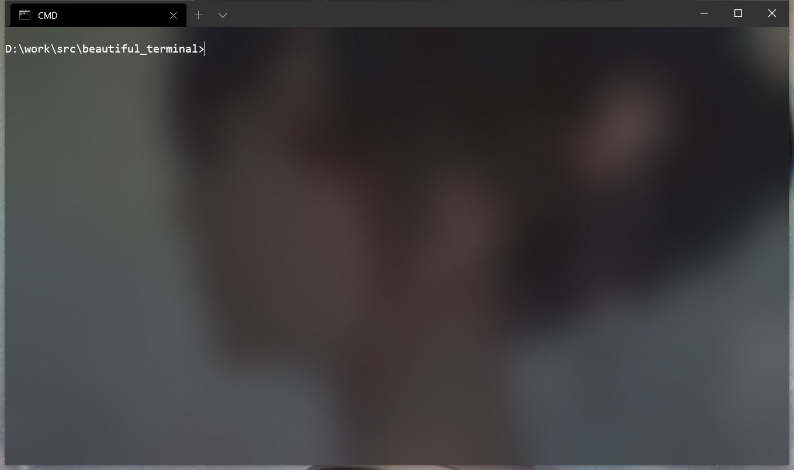
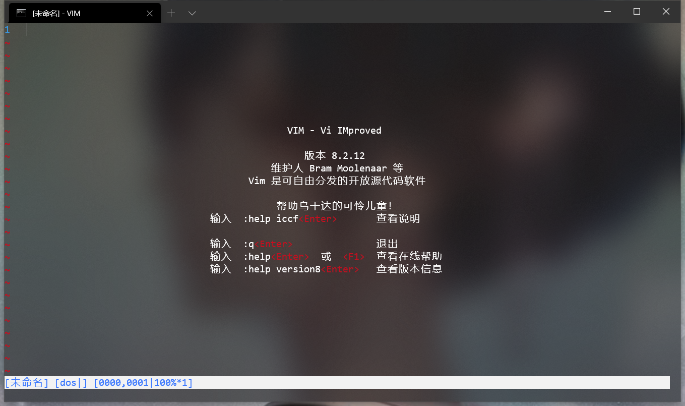
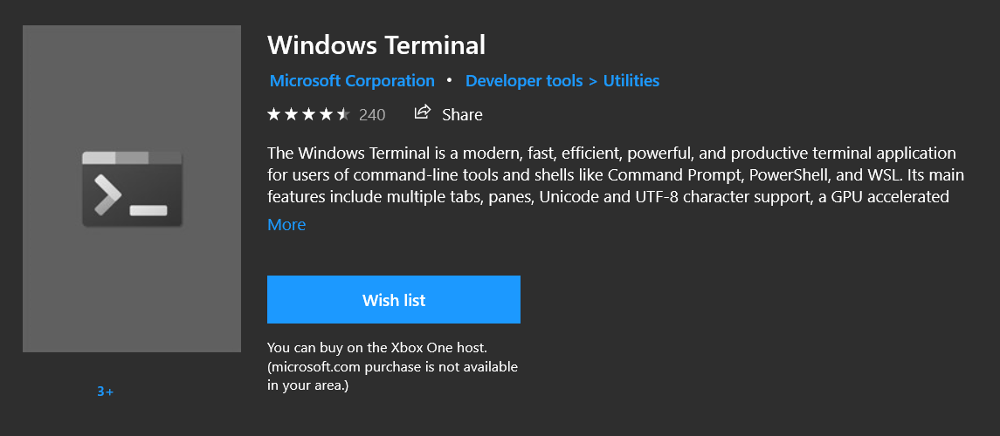
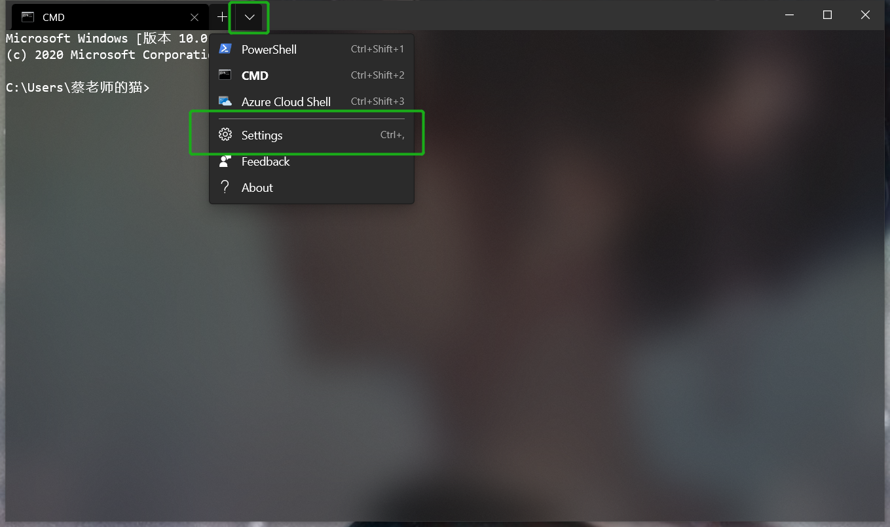

# Make your Windows Terminal more beautiful

## Table of Contents

- [Result](#Result)
- [Install](#Install)
- [Beautify](#Beautify)
- [Scheme](#Scheme)

## Result




## Install
Download `Windows Terminal` in Mircosoft Store

## Install
Download `Windows Terminal` in Mircosoft Store


## Beautify
Open the terminal Settings:



### Beautify your Cmd:

```sh
                "name": "CMD",
                "commandline": "cmd.exe",
                "hidden": false,
		"acrylicOpacity" : 0.5,
            	"background" : "#000000",  
            	//if you want add picture to background
            	//"backgroundImage" :"path of picture",
            	"backgroundImageOpacity" : 0.9,  
            	"closeOnExit" : true,
            	"colorScheme" : "CMD",  
            	"cursorColor" : "#FFFFFF",
            	"cursorShape" : "bar",
            	"fontFace" : "Consolas",
            	"fontSize" : 12,
            	"historySize" : 9001,
            	"padding" : "0, 0, 0, 0",
            	"snapOnInput" : true,
            	"startingDirectory" : "%USERPROFILE%"
            	"useAcrylic" : true   
```

### Beautify your PowerShell

``` sh
                "name": "PowerShell",
                "commandline": "powershell.exe",
                "hidden": false,
            	"acrylicOpacity" : 0.75,
            	//if you want add picture to background
            	//"backgroundImage" :"path of picture",
            	"backgroundImageOpacity" : 0.9,
            	"closeOnExit" : true,
            	"colorScheme" : "CMD",
            	"cursorColor" : "#FFFFFF",
            	"cursorShape" : "bar",
            	"fontFace" : "Consolas",
            	"fontSize" : 12,  
		"historySize" : 9001,
            	"padding" : "0, 0, 0, 0",
            	"snapOnInput" : true,
            	"startingDirectory" : "%USERPROFILE%",
            	"useAcrylic" : true 
```

## Scheme

```sh
    "schemes": [        {
	            "background" : "#000000",
	            "black" : "#0C0C0C",
	            "blue" : "#0037DA",
	            "brightBlack" : "#767676",
	            "brightBlue" : "#3B78FF",
	            "brightCyan" : "#61D6D6",
	            "brightGreen" : "#16C60C",
	            "brightPurple" : "#B4009E",
	            "brightRed" : "#E74856",
	            "brightWhite" : "#F2F2F2",
	            "brightYellow" : "#F9F1A5",
	            "cyan" : "#3A96DD",
	            "foreground" : "#FFFFFF",
	            "green" : "#13A10E",
	            "name" : "CMD",     
	            "purple" : "#881798",
	            "red" : "#C50F1F",
	            "white" : "#CCCCCC",
	            "yellow" : "#C19C00"
	        },],
```

Restart your terminol
